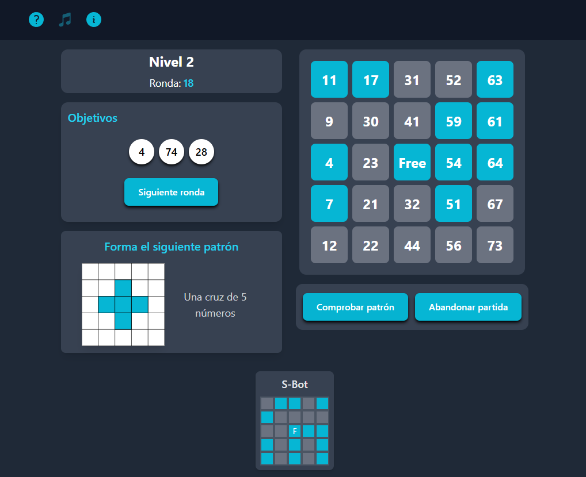

# Bingo-App-1.1 🥈

 

Demo de videojuego de Bingo con Bots simulados con React.

Tecnologias utilizadas: HTML, TailwindCSS, TypeScript, React

Librerias utilizadas: HeroIcons, HeadlessUI y ToneJS

Historial de versiones:

1.0.0: 08/01/2025

- Implemente un reproductor de musica con ToneJS.
- El jugador y cada uno de los bots solamente podrian tener 1 solo tablero.
- Tiene más de 5 niveles.

1.0.1: 19/01/2025

- Puedes desbloquear hasta 20 niveles.
- Algunos niveles tiene 2 tableros para el jugador.
- No es adaptable a dispositivos moviles.

1.0.2: 25/01/2025

- Ahora es adaptable a dispositivos moviles, puedes jugarlo desde tu celular.

1.1: 22/03/25

- Recupere una versión anterior del proyecto (7/2/25) con algunas mejoras.
- Hice algunas mejoras en los niveles, porque eran dificiles derrotar a un bot.

Versión de prueba: [Haga clic aqui para jugar](https://stately-hummingbird-3bc0f1.netlify.app/)

## Captura de pantalla

## ENLACES:

https://stackoverflow.com/questions/35435042/how-can-i-define-an-array-of-objects

https://stackoverflow.com/questions/23161486/create-strongly-typed-array-of-arrays-in-typescript

https://github.com/nsamelson/AIGameRunner/blob/a51fad7b8ed9ffeb3c972ccb65c29030c2b9985e/public/games/quixo.js

Aplica el principio de inmutabilidad en React, pues sort() es un metodo que muta el arreglo original
Tener en cuenta si un metodo muta el arreglo original o no
https://doesitmutate.xyz/
Algoritmo de Fisher-Yates
https://keepcoding.io/blog/algoritmo-de-barajado-de-fisher-yates-en-js/
https://es.wikipedia.org/wiki/Algoritmo_de_Fisher-Yates
